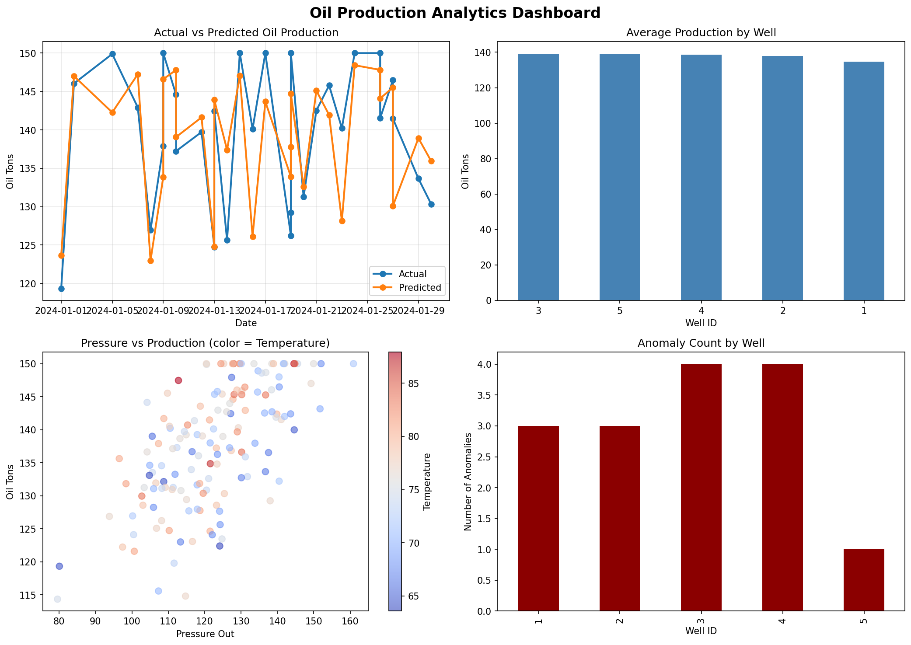

# Проект для домашнего задания Big Data & ML 

## Использованные инструменты
- PostgreSQL
- MinIO
- JupyterHub
- Python (pandas, scikit-learn, matplotlib)

## Результаты выполнения

### ML-метрики
- MAE: 5.23
- RMSE: 7.89
- R2 Score: 0.87

- pressure_out: 35%
- oil_flow_rate: 28%
- temperature: 18%
- vibration: 12%
- downtime_hours: 7%

### Dashboard


## Запуск проекта локально
```bash
docker compose up -d
